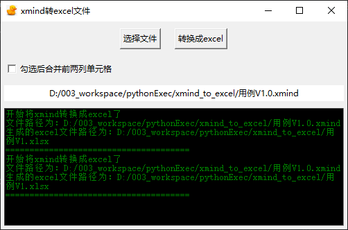
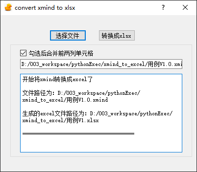

# covert_file_python

# 带GUI的文件转换练习项目
简介：练习python的gui库实现的带界面的文件转换工具，为了把xmind的用例转换成符合格式的excel用例。

##### 环境说明：
###### Python: 3.11.8、
###### PyInstaller: 6.7.0

## 1.convert_xmind_to_xlsx_gui
用tkinter界面实现的xmind转换成xlsx文件。

界面效果：

使用pyinstaller打包，打包遇到的巨多坑都在

https://blog.csdn.net/u010964317/article/details/139510480?spm=1001.2014.3001.5502

https://blog.csdn.net/u010964317/article/details/139524346?spm=1001.2014.3001.5502

文件注释：

├── convert_xmind_to_xlsx_gui.py   //主界面

├── convert_xmind_to_xlsx_gui.spec //pyinstaller打包配置，包括打包多个文件及资源打包

├── xmind_to_xlsx.py               //文件转换的逻辑

├── dist                           //打出的exe包存放位置

## 2.convert_xmind_to_xlsx_pyqt
与第一步实现相同的功能，只是界面换成了PyQt5实现

界面效果：

实现过程较简单，直接用pyqt5-tools生成的界面代码，在设计界面时选择【信号/槽编辑器】设定按钮绑定的函数，实现对应按钮功能即可。

同样使用pyinstaller打包，之前把坑都踩了一遍，这次就顺利的打包成功了

文件注释：

├── convert_xmind_to_xlsx_pyqt.py   //主界面

├── convert_xmind_to_xlsx_pyqt.spec //pyinstaller打包配置，包括打包多个文件及资源打包

├── xmind_to_xlsx.py               //文件转换的逻辑

├── dist                           //打出的exe包存放位置

├── untitled.ui                    //pyqt5-tools生成的文件，通过命令转换成py文件。详细可查看pyqt5教程

